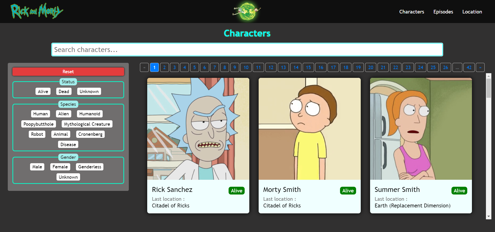
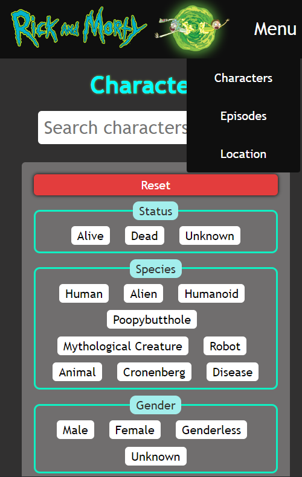
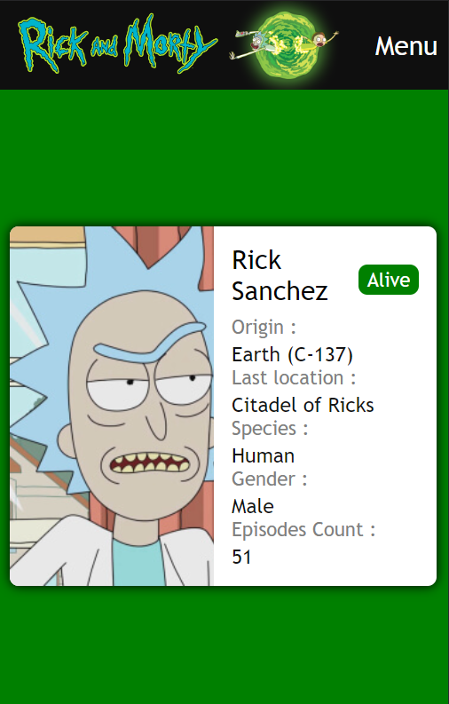

# Rick and Morty 

Projeyi [Rick and Morty API](https://rickandmortyapi.com/) kullanarak yaptım.

**Projede kullandıklarım ;**

* Html
* Css
* JavaScript
* React.js
* Axios
* Rest API ([Rick and Morty API](https://rickandmortyapi.com/))

**Proje üç sayfadan oluşuyor;**

* Karakter sayfasında filtreleme ve arama işlemi yapabiliyoruz.
* Bölümler sayfasında bölüm detayları ve bölümlerde oynayan karakterler listeleniyor.
* Lokasyon sayfasında lokasyon bilgileri ve lokasyondaki karakterler listeleniyor.

## Masaüstü görünüm :

## Mobil görünüm :

### `npm start`

Runs the app in the development mode.\
Open [http://localhost:3000](http://localhost:3000) to view it in your browser.

